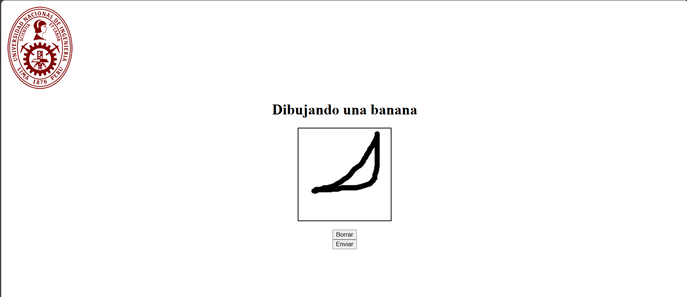
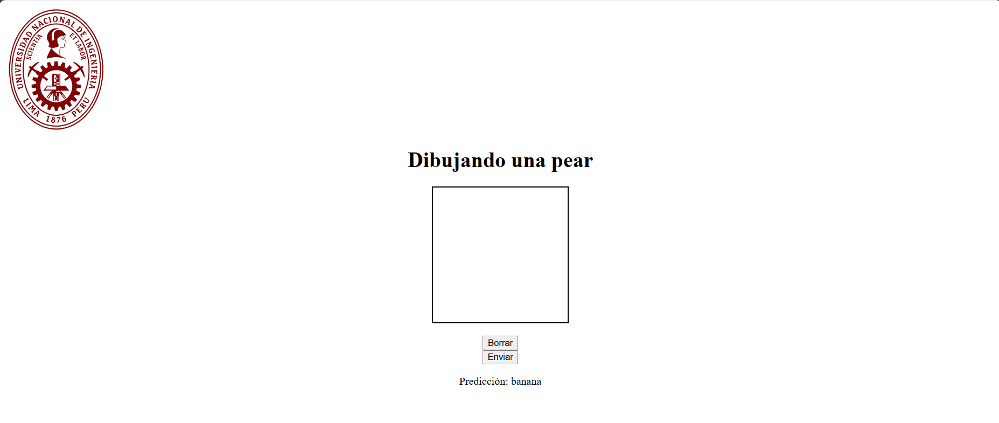

# PC2 - Computacion Grafica

integrantes:

- De la Cruz Valdiviezo, Pedro Luis David
- Luis Angel Azaña Vega

Nuestro modelo trata de la prediccion de 5 tipos de frutas:
1. platano
2. manzana
3. pera
4. piña
5. sandía

Agregamos el valor de la prediccion en la parte inferior del canvas, de manera que cuando se le da
al boton enviar realiza dos cosas, se guarda la imagen y tambien nuestro modelo predice de que categoria pertenece

Por ejemplo dibujamos un platano en el canvas de la siguiente manera:

Luego cuando le damos al boton enviar, se guarda en la carpeta correspondiente, y en la parte inferior
nos informa lo que el modelo predijo:

El entrenamiento del modelo se detalla de mejor manera en el notebook correspondiente. Gracias